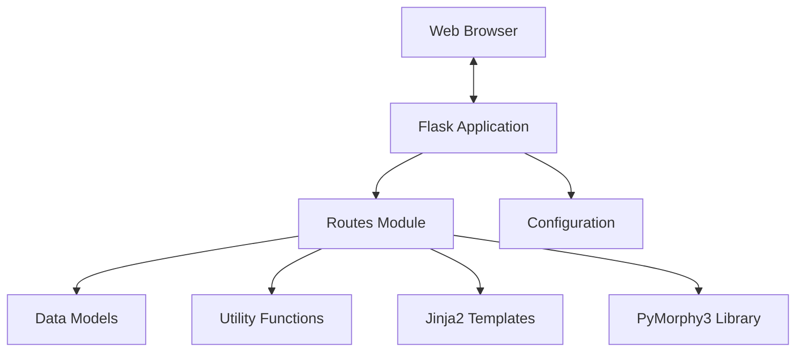
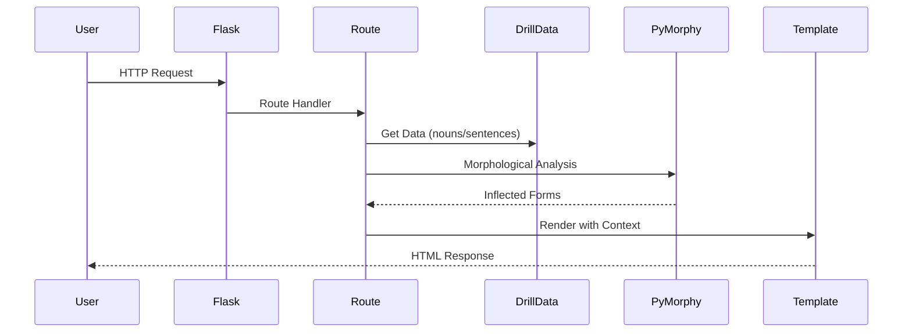
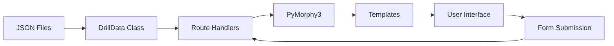

# System Patterns: Russian Noun Cases Drill

## System Architecture

The Russian Noun Cases Drill application follows a classic Flask web application architecture with a clear separation of concerns:

### Core Components

1. **Flask Application (`app.py`)**
   - Entry point for the application
   - Initializes the Flask app and configuration
   - Sets up the PyMorphy3 analyzer
   - Registers routes

2. **Routes (`routes.py`)**
   - Defines all HTTP endpoints
   - Handles request processing and response generation
   - Implements the logic for each drill type
   - Manages session data (e.g., language preference)

3. **Data Models (`models.py`)**
   - Defines the `DrillData` class for managing drill-related data
   - Loads and provides access to nouns and sentences from JSON files
   - Handles language-specific options for cases and numbers

4. **Utilities (`utils.py`)**
   - Provides helper functions for translations
   - Generates drill questions
   - Validates user answers and provides feedback

5. **Templates (Jinja2)**
   - `base.html`: Base template with common layout elements
   - Drill-specific templates for each exercise type
   - Supports bilingual UI through translation dictionaries

6. **Configuration (`config.py`)**
   - Defines application settings
   - Manages environment variables
   - Sets default language and supported languages

7. **Static Assets**
   - CSS for styling the application
   - Responsive design for various device sizes

## Key Technical Decisions

### 1. PyMorphy3 for Morphological Analysis
The application uses PyMorphy3, a morphological analyzer for Russian, to:
- Parse Russian words and identify their grammatical properties
- Generate correctly inflected forms of nouns based on case and number
- Provide the base form (lemma) of inflected words

### 2. JSON Data Storage
- Noun and sentence data are stored in JSON files (`data/nouns.json` and `data/sentences.json`)
- This approach provides:
  - Easy maintenance and updates without code changes
  - Clear separation of data from application logic
  - Simple structure for potentially expanding the word/sentence database

### 3. Session-Based Language Preference
- User language preference (English or Russian) is stored in the Flask session
- This allows for a persistent language setting across page navigations
- The application defaults to English if no preference is set

### 4. Form-Based Interaction Model
- Each drill uses HTML forms for user interaction
- Hidden form fields maintain state between submissions
- Different form actions ("submit" vs "next") control the application flow

## Component Relationships

### Request Flow Pattern

### Data Flow Pattern

## Design Patterns in Use

1. **Model-View-Controller (MVC)**
   - Models: `DrillData` class and data files
   - Views: Jinja2 templates
   - Controllers: Route handlers in `routes.py`

2. **Factory Pattern**
   - The `create_app()` function in `app.py` serves as a factory for the Flask application
   - Allows for potential testing configurations or multiple app instances

3. **Template Method Pattern**
   - Base template (`base.html`) defines the overall structure
   - Specific drill templates extend and override blocks as needed

4. **Strategy Pattern**
   - Different drill types implement different strategies for practice
   - Each drill route follows a similar pattern but with specific logic

5. **Dependency Injection**
   - PyMorphy3 analyzer is created once and passed to route initialization
   - Allows for potential mocking in tests and centralized resource management
